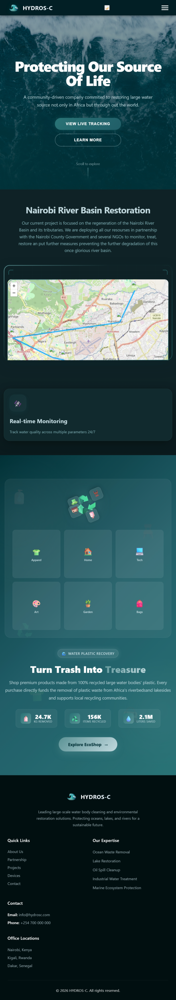

#  HYDROSPHERE-C

> *"Small actions, when multiplied by millions of people, can transform the world."*

A full-stack environmental impact platform that turns consumer purchases into measurable large water bodies cleanup and tracks water pollution administering treatment. Every product sold funds plastic removal from East Africa's coastlines, riverbasins and lakebeds.

---

##  Table of Contents

- [Overview](#overview)
- [Features](#features)
- [Tech Stack](#tech-stack)
- [Project Structure](#project-structure)
- [Installation & Setup](#installation--setup)
- [Environment Variables](#environment-variables)
- [API Reference](#api-reference)
- [Database Models](#database-models)
- [Authentication](#authentication)
- [Screenshots](#screenshots)
- [Future Improvements](#future-improvements)
- [Contributing](#contributing)
- [Author](#author)

---

##  Overview

HYDROSPHERE-C is a full-stack web application that combines **e-commerce with real-world ecological contribution**. Users shop for products made from 100% recycled ocean plastic while tracking their personal environmental impact in real time.

Every purchase directly funds:

-  Ocean,Lake & river plastic removal
-  Recycling initiatives across East Africa
-  Reduction of carbon emissions
-  Water conservation

---

##  Features

###  Shop System
- Browse products by category (fashion, home, accessories, tech, art)
- Sort by price (low/high) or environmental impact
- Add to cart with dynamic quantity controls
- Real-time cart impact calculator
- Purchase celebration animation with confetti

###  Impact Tracking
- Per-order impact calculation
- Cumulative user impact dashboard
- Metrics tracked per purchase:
  - Plastic removed (kg)
  - CO₂ prevented (kg)
  - Water saved (litres)
  - Items recycled (count)

###  Live Monitoring
- Interactive Leaflet map of Nairobi River Basin
- Real-time sensor data overlay
- Live dashboard panel with environmental stats

###  Weather Monitoring
- Real-time weather data via Open-Meteo API (no API key needed)
- 5 Nairobi locations: Westlands, Kamkunji, Embakasi, Starehe, Kasarani
- EAT timezone display, UV index, humidity, wind data
- Auto-refreshes every 5 minutes

###  Authentication
- JWT-based login & registration
- Google OAuth integration
- Protected routes and checkout
- User profile with level/points system

###  UI/UX
- Dark mode toggle (persists via localStorage)
- Pure CSS animations and transitions
- Fully responsive across all screen sizes
- Hero section with animated water background

---

##  Tech Stack

### Frontend
| Tech | Purpose |
|------|---------|
| React 18 + Vite | UI framework & build tool |
| React Router v6 | Client-side routing |
| Axios | HTTP requests |
| Leaflet.js | Interactive maps |
| Pure CSS | All styling (no CSS frameworks) |
| @react-oauth/google | Google OAuth |

### Backend
| Tech | Purpose |
|------|---------|
| Node.js | Runtime environment |
| Express.js | Web framework |
| Mongoose | MongoDB ODM |
| JWT (jsonwebtoken) | Authentication tokens |
| Passport.js | OAuth strategy handler |
| express-session | Session management |
| bcryptjs | Password hashing |
| dotenvx | Environment variable management |
| nodemon | Development server auto-restart |

### Database
| Tech | Purpose |
|------|---------|
| MongoDB Atlas | Cloud database (production) |
| MongoDB Community | Local database (development) |

### External APIs
| API | Purpose |
|-----|---------|
| Open-Meteo | Free real-time weather data (EAT timezone) |
| Google OAuth 2.0 | Social login |

---

##  Project Structure

```
hydrosphere-c/
│
├── client/                          # React Vite frontend
│   ├── public/
│   ├── src/
│   │   ├── assets/                  # Images, icons
│   │   │   └── water.png
│   │   ├── components/              # Reusable components
│   │   │   ├── navbar.jsx
│   │   │   ├── Footer.jsx
│   │   │   ├── DarkModeToggle.jsx
│   │   │   ├── WeatherSection.jsx
│   │   │   ├── GarbageShopSection.jsx
│   │   │   └── ProtectedRoute.jsx
│   │   ├── context/
│   │   │   └── AuthContext.jsx      # Global auth state
│   │   ├── hooks/
│   │   │   └── useDarkMode.js       # Dark mode hook
│   │   ├── pages/
│   │   │   ├── Home.jsx
│   │   │   ├── Shop.jsx
│   │   │   ├── About.jsx
│   │   │   ├── Contact.jsx
│   │   │   ├── Projects.jsx
│   │   │   ├── PartnerWithUs.jsx
│   │   │   ├── BecomeInvolved.jsx
│   │   │   ├── Login.jsx
│   │   │   ├── Register.jsx
│   │   │   ├── AuthCallback.jsx
│   │   │   └── Weathersection.jsx
│   │   ├── styles/                  # Page-scoped CSS files
│   │   │   ├── home.css
│   │   │   ├── shop.css
│   │   │   ├── darkmode.css
│   │   │   └── ...
│   │   ├── App.jsx
│   │   └── main.jsx
│   ├── index.html
│   ├── vite.config.js
│   └── package.json
│
├── server/                          # Express.js backend
│   ├── config/
│   │   └── passport.js              # Google OAuth strategy
│   ├── middleware/
│   │   └── auth.js                  # JWT protect middleware
│   ├── models/
│   │   ├── User.js                  # User schema
│   │   ├── RecycledProduct.js       # Product schema
│   │   ├── Order.js                 # Order schema
│   │   ├── Innovation.js
│   │   └── Report.js
│   ├── routes/
│   │   ├── auth.js                  # /api/auth/*
│   │   ├── user.js                  # /api/user/*
│   │   └── Shop.js                  # /api/shop/*
│   ├── seeds/
│   │   └── seedProducts.js          # Database seeder (12 products)
│   └── server.js                    # Entry point
│
├── .env                             # Environment variables
├── package.json                     # Server package.json
└── README.md
```

---

## Installation & Setup

### Prerequisites
- Node.js v18+
- MongoDB (local) or MongoDB Atlas account
- Git

### 1. Clone the repository

```bash
git clone https://github.com/delarum/hydrosphere-c-client.git
cd hydrosphere-c
```

### 2. Start local MongoDB

MongoDB must be running before starting the server.

```bash
# First time only — create the data directory
mkdir -p C:/data/db

# Start MongoDB (keep this terminal open)
"C:/Program Files/MongoDB/Server/8.2/bin/mongod.exe" --dbpath "C:/data/db"
```

> **Tip:** Run MongoDB as a Windows service so it starts automatically:
> ```cmd
> "C:\Program Files\MongoDB\Server\8.2\bin\mongod.exe" --dbpath "C:\data\db" --logpath "C:\data\log\mongod.log" --install
> net start MongoDB
> ```

### 3. Install server dependencies

```bash
# From project root
npm install
```

### 4. Install client dependencies

```bash
cd client
npm install
```

### 5. Configure environment variables

Create `.env` in the project root (server):

```env
NODE_ENV=development
PORT=5000
MONGODB_URI=mongodb://localhost:27017/hydros-c
JWT_SECRET=your_jwt_secret_here
SESSION_SECRET=your_session_secret_here
CLIENT_URL=http://localhost:5173
GOOGLE_CLIENT_ID=your_google_client_id
GOOGLE_CLIENT_SECRET=your_google_client_secret
```

Create `.env` in `client/`:

```env
VITE_API_URL=http://localhost:5000/api
VITE_GOOGLE_CLIENT_ID=your_google_client_id
```

### 6. Seed the database

```bash
# From project root — adds 12 products across all categories
node server/seeds/seedProducts.js
```

### 7. Start the development servers

**Terminal 1 — Backend:**
```bash
npm run dev
# → Server running on http://localhost:5000
```

**Terminal 2 — Frontend:**
```bash
cd client
npm run dev
# → App running on http://localhost:5173
```

---

## Environment Variables

### Server `.env`

| Variable | Description | Example |
|----------|-------------|---------|
| `NODE_ENV` | Environment | `development` |
| `PORT` | Server port | `5000` |
| `MONGODB_URI` | MongoDB connection string | `mongodb://localhost:27017/hydros-c` |
| `JWT_SECRET` | JWT signing secret (keep long & random) | `abc123...` |
| `SESSION_SECRET` | Express session secret | `xyz789...` |
| `CLIENT_URL` | Frontend URL for CORS | `http://localhost:5173` |
| `GOOGLE_CLIENT_ID` | Google OAuth client ID | From Google Cloud Console |
| `GOOGLE_CLIENT_SECRET` | Google OAuth secret | From Google Cloud Console |

### Client `.env`

| Variable | Description | Example |
|----------|-------------|---------|
| `VITE_API_URL` | Backend API base URL | `http://localhost:5000/api` |
| `VITE_GOOGLE_CLIENT_ID` | Google OAuth client ID | From Google Cloud Console |

---

##  API Reference

### Base URL
```
http://localhost:5000/api
```

### Health Check
| Method | Endpoint | Description |
|--------|----------|-------------|
| `GET` | `/health` | Server status + DB connection state |
| `GET` | `/test-db` | Lists all MongoDB collections |

---

### Auth Routes — `/api/auth`

| Method | Endpoint | Auth | Description |
|--------|----------|------|-------------|
| `POST` | `/api/auth/register` | ❌ | Register new user |
| `POST` | `/api/auth/login` | ❌ | Login, returns JWT |
| `GET` | `/api/auth/google` | ❌ | Initiate Google OAuth |
| `GET` | `/api/auth/google/callback` | ❌ | Google OAuth callback |
| `POST` | `/api/auth/logout` | ✅ | Logout user |

**Register body:**
```json
{
  "firstName": "Del",
  "lastName": "Arum",
  "email": "del@example.com",
  "password": "SecurePass@123",
  "age": 23
}
```

**Login body:**
```json
{
  "email": "del@example.com",
  "password": "SecurePass@123"
}
```

**Login response:**
```json
{
  "success": true,
  "token": "eyJhbGci...",
  "user": { "id": "...", "firstName": "Del", "email": "del@example.com" }
}
```

---

### User Routes — `/api/user`

| Method | Endpoint | Auth | Description |
|--------|----------|------|-------------|
| `GET` | `/api/user/profile` | ✅ | Get current user profile |
| `PUT` | `/api/user/profile` | ✅ | Update profile |

---

### Shop Routes — `/api/shop`

| Method | Endpoint | Auth | Description |
|--------|----------|------|-------------|
| `GET` | `/api/shop/products` | ❌ | Get all products (with filters) |
| `GET` | `/api/shop/products/:id` | ❌ | Get single product |
| `POST` | `/api/shop/order` | ✅ | Place an order |
| `GET` | `/api/shop/my-impact` | ✅ | Get user's cumulative impact |

**GET /api/shop/products — Query params:**

| Param | Values | Description |
|-------|--------|-------------|
| `category` | `fashion` `home` `accessories` `tech` `art` | Filter by category |
| `sort` | `price-low` `price-high` `impact` | Sort results |
| `featured` | `true` | Show featured only |

**Example:**
```
GET /api/shop/products?category=fashion&sort=impact
```

**POST /api/shop/order — Body:**
```json
{
  "items": [
    { "productId": "64abc123...", "quantity": 2 }
  ],
  "shippingAddress": {
    "street": "Moi Avenue",
    "city": "Nairobi",
    "country": "Kenya"
  }
}
```

**Order response:**
```json
{
  "success": true,
  "order": { "_id": "...", "status": "pending", "totalAmount": 69.98 },
  "totalImpact": {
    "plasticRemoved": 0.3,
    "co2Prevented": 4.2,
    "waterSaved": 5400,
    "itemsRecycled": 12
  }
}
```

**GET /api/shop/my-impact — Response:**
```json
{
  "success": true,
  "impact": {
    "plasticRemoved": 1.45,
    "co2Prevented": 18.6,
    "waterSaved": 24300,
    "itemsRecycled": 58
  },
  "orderCount": 4
}
```

---

## Database Models

### User
```
_id, firstName, lastName, email, password (hashed),
age, googleId, impactStats { plasticRemoved, co2Prevented,
waterSaved, itemsRecycled }, points, level, createdAt
```

### RecycledProduct
```
_id, name, description, price, image,
category (fashion|home|accessories|tech|art),
impact { plasticRemoved, co2Prevented, waterSaved, itemsRecycled },
stock, sold, rating, reviews, featured, badge
(Bestseller|New|Limited), createdAt
```

### Order
```
_id, user (ref: User), items [{ product, quantity, price, impact }],
totalAmount, totalImpact { plasticRemoved, co2Prevented,
waterSaved, itemsRecycled }, status (pending|processing|
shipped|delivered), shippingAddress { street, city, country },
createdAt
```

---

##  Authentication Flow

```
1. User submits credentials
        ↓
2. Server validates & bcrypt compares password
        ↓
3. JWT token issued (stored client-side)
        ↓
4. Protected routes check: Authorization: Bearer <token>
        ↓
5. auth.js middleware decodes token → attaches req.user
        ↓
6. Route handler executes with authenticated user context
```

**Google OAuth flow:**
```
1. User clicks "Sign in with Google"
        ↓
2. Redirect to /api/auth/google
        ↓
3. Google redirects to /api/auth/google/callback
        ↓
4. Passport finds/creates user by googleId
        ↓
5. JWT issued → redirect to client with token
```

---

## Screenshots




##  Future Improvements

- [ ] Stripe/PayPal payment gateway
- [ ] Order tracking with delivery status
- [ ] Live global impact dashboard (aggregated across all users)
- [ ] AI-based product recommendations
- [ ] Push notifications for order updates
- [ ] Admin dashboard for product & order management
- [ ] Mobile app (React Native)
- [ ] Expanded sensor network beyond Nairobi

---

##  Contributing

Contributions are welcome!

1. Fork the project
2. Create your feature branch (`git checkout -b feature/AmazingFeature`)
3. Commit your changes (`git commit -m 'Add AmazingFeature'`)
4. Push to the branch (`git push origin feature/AmazingFeature`)
5. Open a Pull Request

---

##  Known Issues

- MongoDB Atlas may require IP whitelisting — use local MongoDB for development
- Google OAuth button width warning in console (cosmetic only)
- Shop products require seeding before first use: `node server/seeds/seedProducts.js`

---

##  License

This project is licensed under the **MIT License**.

---

## Support & Contact

| Channel | Details |
|---------|---------|
| Email | delarum7@gmail.com |
| Phone | +254 792 651 083 |
| GitHub | [@delarum](https://github.com/delarum) |

---

## Author

Developed with passion for sustainability and technology by **Del Arum**.

*Bridging the gap between technology, sustainability, and everyday consumer behavior.*